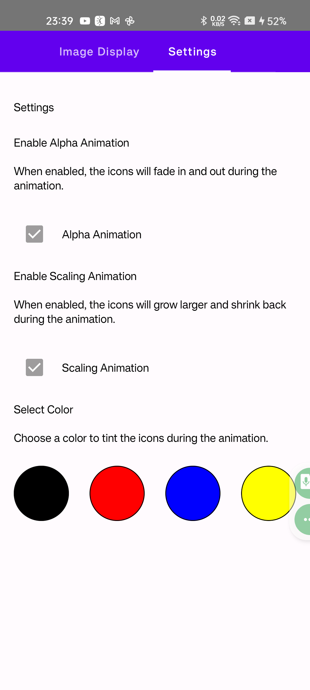
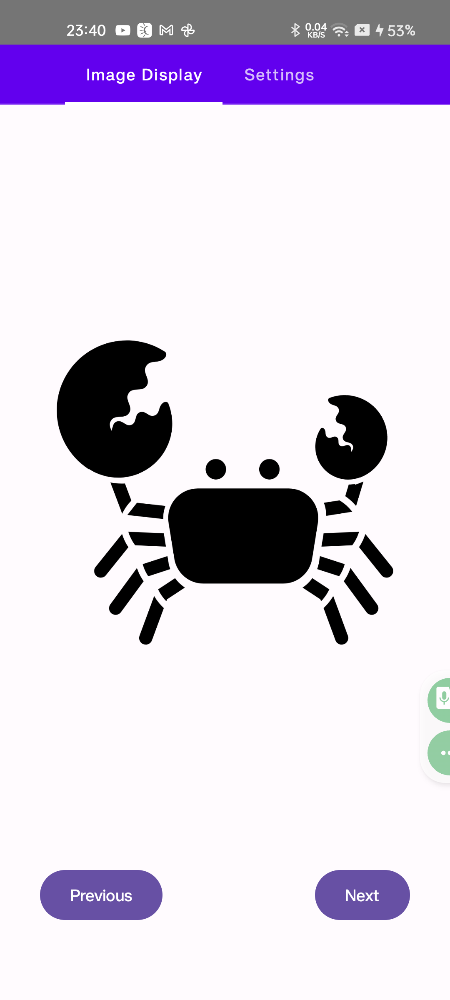
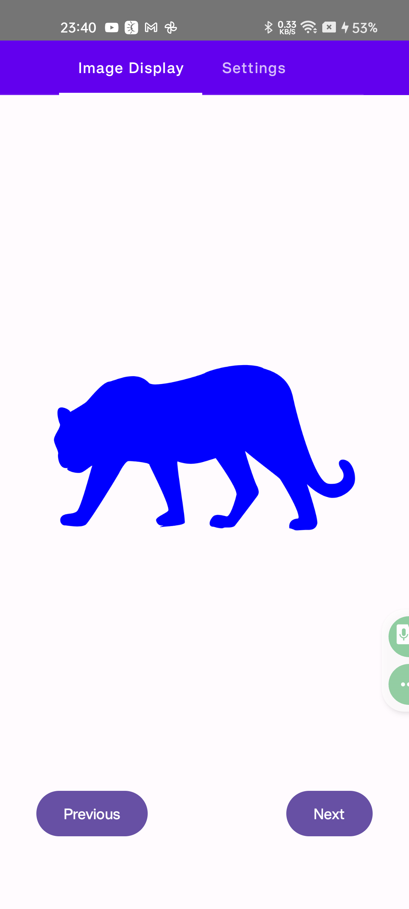

# BabyShapes

**BabyShapes** is a simple and engaging app designed for newborns and infants to help train their attention and focus through animations and colors. The app provides interactive features like alpha animations, scaling animations, and color tinting, all while being visually appealing for little ones.

---

## Features

- **Interactive Animations**: Smooth alpha and scaling animations to capture attention.
- **Color Selection**: Choose from a set of bold and vibrant colors to tint the icons.
- **Simple Settings**: Enable or disable animations easily from the settings page.
- **Clean and Minimalist Design**: Designed with a focus on simplicity and visual appeal.

---

## What's New in Version 2.0?

This update introduces several enhancements to improve the usability, appearance, and functionality of the app:

### **Settings Page Improvements**
- Added descriptive text for settings options to provide better user understanding.
- Introduced a clean and organized header for the settings page.
- Enhanced layout for color selection using `Arrangement.SpaceBetween` for better spacing and alignment.
- Improved checkboxes with meaningful labels and descriptions for clarity.

### **Image Display Enhancements**
- Updated the image display with a circular card design, including shadow effects and scaling animations for a polished look.
- Added a gradient background to the main screen, creating a more visually engaging design.

### **Improved Navigation**
- Redesigned navigation buttons with vibrant circular buttons and bold text for better interactivity.

### **Code Improvements**
- Refactored constants (e.g., animation duration, scale, and alpha values) for better maintainability and readability.

---

## Screenshots

### 1. Settings Page

### 2. Image Display (Example 1)

### 3. Image Display (Example 2)

---

## How to Use

1. Open the app and navigate through the **Image Display** and **Settings** tabs.
2. In the **Image Display** tab:
   - See animated icons that change colors and size.
   - Use the "Previous" and "Next" buttons to navigate through the icons.
3. In the **Settings** tab:
   - Toggle **Alpha Animation** and **Scaling Animation** to customize the animations.
   - Select a color to tint the icons during animations.

---

## License

This project is licensed under the MIT License. See the [LICENSE](LICENSE) file for details.
